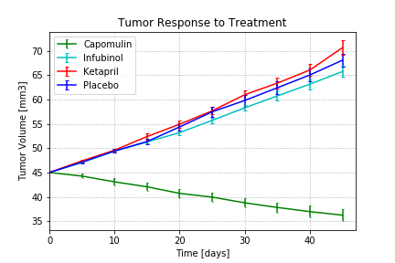
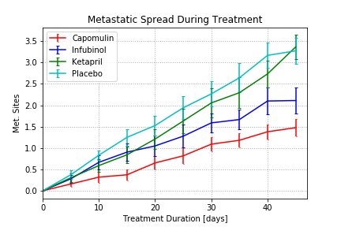
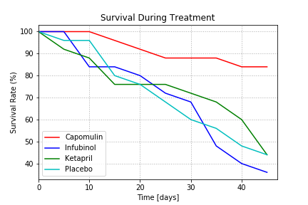
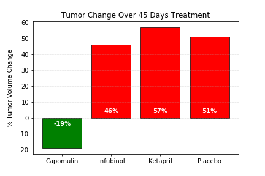

# Pymaceuticals_plot

## Drugs (Capomulin, Infubinol, Ketapril & Placebo) treatment data analysis

## Tools / Technologies used: 
Python, Pandas Library, Matplotlib Library and Jupyter Notebook.
## Background
For this project, a group of 250 mice were monitored after administration of a variety of drug regimens over a 45-day treatment period. The impact of four drugs treatments (Capomulin, Infubinol, Ketapril & Placebo) on tumor volume, limiting metastatic and survival rates were analyzed. The result plots and conclusions are summarized below.

## Findings
1) When we compare all treatments, Capomulin seems the most effective drug in terms of decreasing tumor volume, limiting metastatic spread and survival rate of mice.
2) For those four treatment options, Capomulin was the only treatment showing success in reducing tumor volume with a 19% reduction over the 45-day course of treatment.
3) Mice treatment with Infubinol had lesser tumor growth and cancer spreading than those treated with Ketapril or placebo, but the mortality rate looked higher than others.

